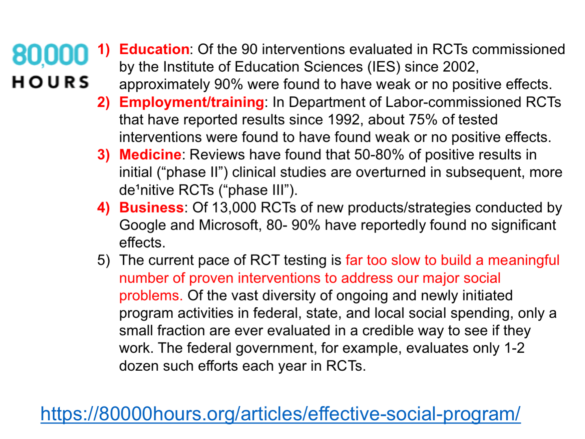
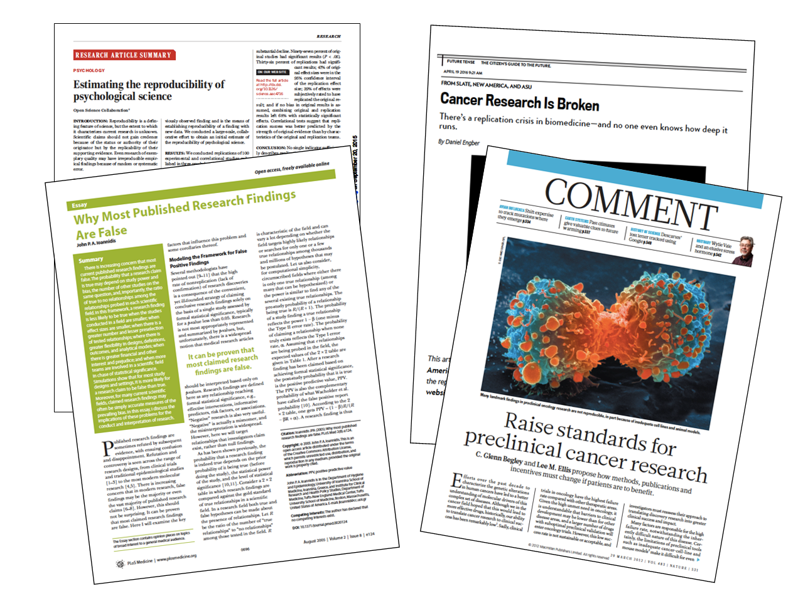

```{r setup, include=FALSE}
knitr::opts_chunk$set(echo = FALSE)
```

## Role Of Research In Social Work

Social work is a profession dedicated to social justice and the improvement of well-being.

## Concerns About The Research Base for Social Programs And Interventions

```{r}



```


## Why We Include It In The Social Work Prelim

* There is a lot of pain and suffering in the world.
* A profession that makes claims to address pain, suffering, and injustice needs to be able to back up its claims with evidence.

## Savedoff and Levine

> “No physician would consider prescribing strong medications whose impact and potential side-effects have not been properly evaluated. Yet in social development programs, where huge sums can be spent to modify population behaviors, change economic livelihoods, and potentially alter cultures or family structure, no such standard has been adopted. 

> While it is widely recognized that withholding programs that are known to be beneficial would be unethical, the implicit corollary—that programs of unknown impact should not be widely replicated without proper evaluation—is frequently dismissed.”

— Ruth Levine and William Savedoff (2006)

Savedoff, W., R. Levine, et al. (2006). When Will We Ever Learn? Improving Lives Through Impact Evaluation. Evaluation Gap Working Group. Washington, DC, Center for Global Development.

## Concerns About Evidence More Generally

```{r}



```

## Incorporating Empirical Evidence Within a Social Work Prelim

## Writing the empirical section of the social work prelim

* Imposter Syndrome
* Drawing The Circle Around Your Question
* Finding The Right Literature
* Writing

## Imposter Syndrome

## Drawing The Circle Around Your Question

## Finding The Right Literature

* Remember the 80/20 rule:  80% of everything is of relatively low value; only 20% is gold.
* There are many studies that “make conclusions.”  Only a very limited set of them are methodologically rigorous, and are real contributions to the literature.
* Start your literature search by reading a good review article, e.g. a recent review piece in Annual Review of Psychology.  What do they cite?  What authors do they think are important?
Then search in a large database like PsychInfo or ProQuest

## Finding The Right Literature (2)

* More recent literature (last 5 years; last 10 years)
* Higher impact journals (Thompson ISI) e.g.
    - *Child Development*
    - *Child Psychology and Psychiatry*
    - *Developmental Psychology*
* Articles from important or longstanding ongoing studies or databases e.g.
    - FFCWS 
    - ADD Health
    - ECLS
    - PSID-CDS

* Seminal or Key Articles from any era or journal (the ones that everyone mentions)

> I still think that the key articles in most literatures end up numbering somewhere between 20 and 50 articles.

## Writing

* Writing is **Hard**
* Write **Many** Rough Drafts (**Share Them!** With your Advisor, or with other people who will read frequent drafts of your writing.)
* Not All Sources Are **Equally Good**

## Not All Sources Are Equally Good

> (author, date) studied (sample) to examine (research question). (author, date) found that ______________.   (author, date) also found that ______________. (author, date) also found that ______________.  However, one (strength/limitation) of the study was that __________________________.  These authors suggested (policy, program, intervention).


