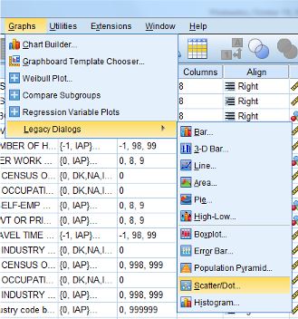
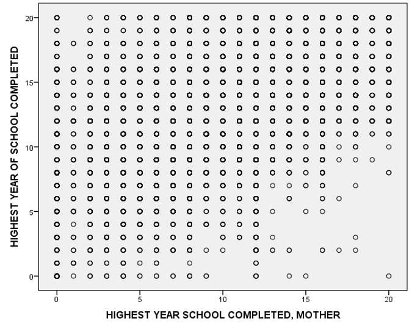
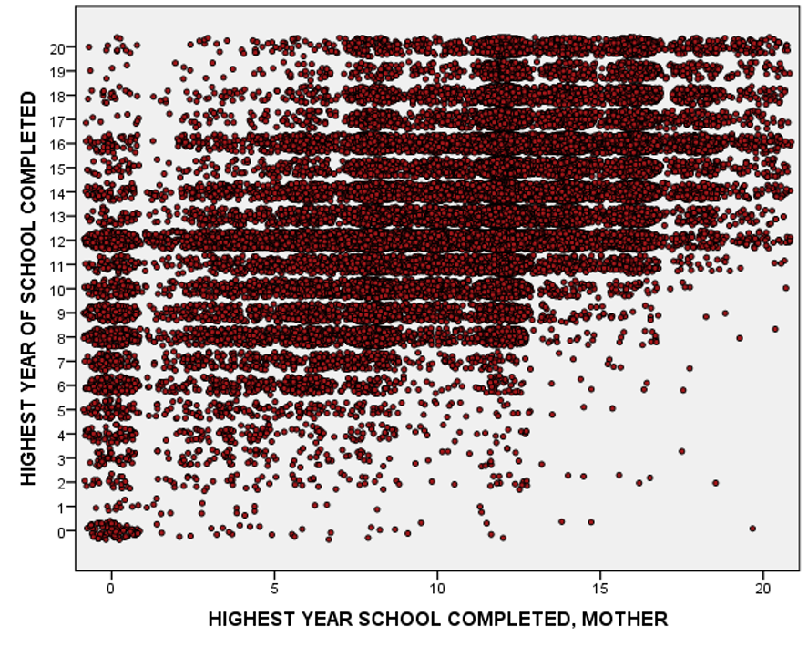

```{r setup, include=FALSE}

knitr::opts_chunk$set(echo = FALSE)

```

# The Issue

Here is a scatterplot made using the General Social Survey. The scatterplot is made using the dialog boxes.

```{r, fig.cap="Scatterplot Menu"}



```

```{r, fig.cap="Scatterplot"}



```

The graph ends up looking odd, because there are only a limited number of values for “Highest Year of School Completed,” and a limited number of values for “Mother’s Highest Year of School Completed.”

Essentially, dots are over-printed, making it difficult to get any sense of the trends in the graph.

We could have also used the syntax below to make a scatter plot, but that would have led to the exact same graph with the exact same problem.

```{spss, echo=TRUE, eval=FALSE}

GRAPH
  /SCATTERPLOT(BIVAR)=maeduc WITH educ
  /MISSING=LISTWISE.

```

In order to solve this problem, we are going to need to create “jitter”, or a small amount of random motion, for each dot, so that we can see the overall pattern of dots more clearly.  SPSS code using the IGRAPH command will let us do this. We enter this code in a syntax window using the particular variables in which we are interested.

```{spss, echo=TRUE, eval=FALSE}

IGRAPH / Y = educ / X1 = maeduc / SCATTER COINCIDENT = JITTER.

```

This SPSS code produces the graph below. 

```{r}



```


> I have double clicked on the graph, and further tweaked the graph slightly by making the dots smaller, with a red center, and black border, to improve the visual presentation.

> In this graph with “jitter”, it is much easier to see the overall trend.


