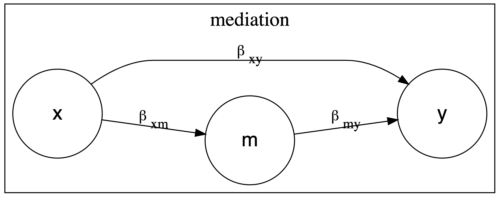

# Mediation vs. Confounding

Trying to understand mediation, and mediation vs. confounding.

The basic idea is that if we are regressing *y* on variable of interest *x*, and control variable *z*, if we introduce mediator *m*, the $\beta_{xy}$ coefficient should change.

