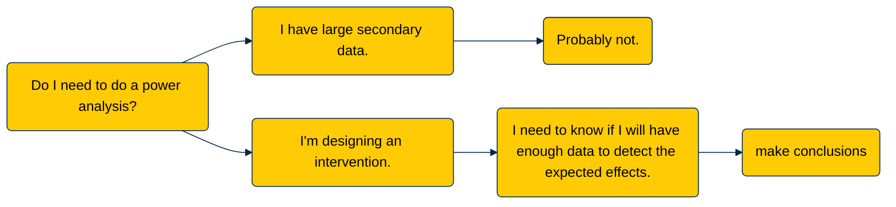

Some thoughts about power analysis.

```mermaid
%%{
  init: {
    'theme': 'base',
    'themeVariables': {
      'primaryColor': '#FFCB05',
      'primaryTextColor': '#000000',
      'primaryBorderColor': '#00274C',
      'lineColor': '#00274C',
      'secondaryColor': '#00274C',
      'secondaryTextColor': '#000000',
      'tertiaryColor': '#F2F2F2',
      'tertiaryBorderColor': '#00274C'
    }
  }
}%%

flowchart LR
  A(Do I need to do a power analysis?) --> B(I have large secondary data.)
  B --> C(Probably not.) 
  A --> D(I'm designing an intervention.)
  D --> E(I need to know if I will have enough data to detect the expected effects.)
  E --> F(make conclusions)
```

