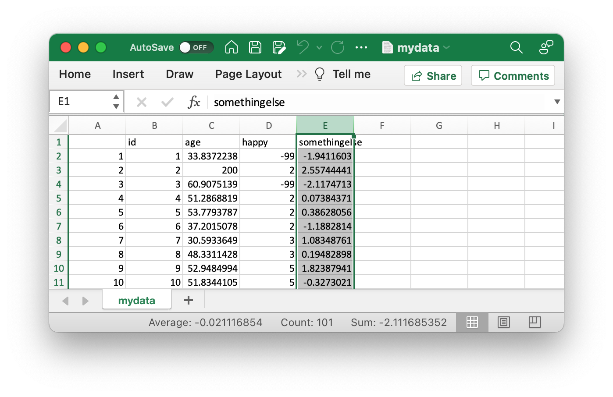
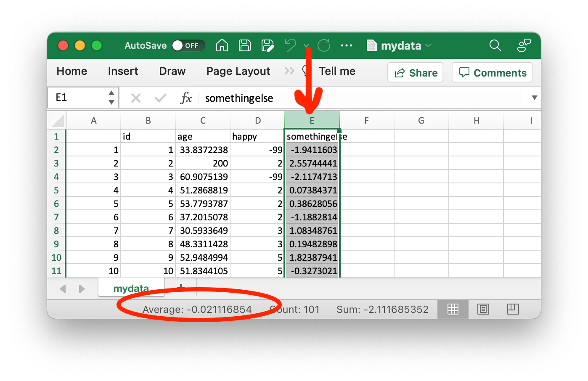

```{r setup, include=FALSE}

knitr::opts_chunk$set(echo = FALSE)

library(pander)

xaringanExtra::use_panelset()

# xaringanExtra::style_panelset_tabs(foreground = "honeydew", 
#                                    background = "seagreen")


library(foreign)

```

```{css, echo=FALSE}

d-article blockquote {
  color: black;
  border-left: 2px solid #FFCB05; 
  padding: 0.5em 10px;
}
h1, h2, h3, h4, h5, h6 {
  color: #00274C;
  font-weight: 300;
}
.panelset {  
  color: #9A3324;
}
  
```

```{r, layout="l-body", out.width="75%"}


```

# Introduction

A great deal of data analysis and visualization involves the same core set of steps.

$$\text{have a question} \rightarrow \text{get data} \rightarrow \text{process and clean data} \rightarrow \text{analyze data}$$ 
Below we describe some simple data cleaning, and simple analysis with 4 tools: Excel, Google Sheets, R, and Stata.

# Some Tools for Analysis

----------------------------------------------------------------------------
Tool     Cost         Ease         Analysis       Suitability   Keep                 
                      of           Capabilities   for           Track of
                      Use                         Large Data    Complicated
                                                                Workflows
-------- ---------    ------------ -------------  ------------  --------------
Excel    Comes        Easy         Limited        Difficult     Difficult to
         installed                                when          Impossible
         on many                                  N > 100
         computers

Google   Free         Easy         Limited        Difficult     Difficult to
Sheets   with a                                   when          Impossible
         Google                                   N > 100
         account
            
R        Free         Challenging  Extensive      Excellent     Yes, with
                                                  with          script
                                                  large 
                                                  datasets
                                                    
Stata    Some         Learning     Extensive      Excellent     Yes, with
         cost         Curve                       with          command
                      but                         large         file
                      Intuitive                   datasets
----------------------------------------------------------------------------

# Our Data

We take a look at our *simulated* data, which has an `id` number, `age`, and `happiness` (on a 5 point scale, with 5 being the happiest.)

```{r, echo=FALSE}

N <- 100 # sample size

id <- seq(1, N) # id number

group <- rbinom(N, 1, .5) # group

group <- factor(group, 
                levels = c(1,0),
                labels = c("Group A",
                           "Group B"))

age <- rnorm(N, 50, 10) # normally distributed age

age[2] <- 200 # someone is 200 years old

happy <- round(runif(N, 1, 5)) # 5 point happiness scale

happy[1] <- -99

happy[3] <- -99

somethingelse <- rnorm(N, 0, 1) # something else!

mydata <- data.frame(id, group, age, happy, somethingelse)

write.csv(mydata, file = "mydata.csv") # write to CSV

write.dta(mydata, file = "mydata.dta") # write to Stata

pander(head(mydata)) # show the data

```

Notice that…

* There are variables in which we may not have interest (e.g. `somethingelse`).
* None of the variables have informative *variable labels*. We have to guess at what the variables mean.
* Variables do not seem to have informative *value labels*. While somewhat intuitive, we have to guess at what the values mean.
* Someone appears to 200 years old.
* There appear to be missing values in the variable happy that need to be recoded.

# Cleaning Data

There are some basic data cleaning steps that are common to many projects.

1. Only keep the variables of interest.
2. Add variable labels (if we can).
3. Add value labels (if we can).
4. Recode outliers, values that are errors, or values that should be coded as missing

::::: {.panelset}

::: {.panel}

## Excel and Google Sheets {.panel-name}

### 1. Only keep the variables of interest.

> Select the column, or columns, of data that you wish to remove, and right click, or control click, to delete them.

```{r, out.width="50%"}



```

### 2. Add variable labels (if we can).

> We are unable to add informative labels to **variables** in Excel or Google Sheets.

### 3. Add value labels (if we can).

> We are unable to add informative labels to **values** in Excel or Google Sheets.

### 4. Recode outliers, values that are errors, or values that should be coded as missing.

> We are likely going to have to use **find and replace** to manually replace problematic values. For example, we will want to replace the `200` in the `age` column with a `.` or `NA` for missing. Similarly, we will want to replace the values of `-99` in the `happy` column with a `.` or `NA` for missing.

> For small data sets, this will not be difficult, but for larger data sets--especially data with many different kinds of values that need to be recoded--this process will become more difficult and cumbersome.

:::

::: {.panel}

## R {.panel-name}

> Much of R's functionality is accomplished through writing *code*, that is saved in a *script*. Notice how--as our tasks get more and more complicated--the saved script provides documentation for the decisions that we have made with the data.

### 1. Only keep the variables of interest.

> We can easily accomplish this with the `subset` function

```{r, echo=TRUE}

mynewdata <- subset(mydata,
                    select = c(id, group, age, happy))
```

```{r}

pander(head(mynewdata))

```

### 2. Add variable labels (if we can).

> Adding *variable labels* is not well established in R. There are libraries that can add variable labels for some purposes, but not every library in R recognizes *variable labels*.

### 3. Add value labels (if we can).

> In contrast, *value labels* are straightforward in R, and can be accomplished by creating a *factor variable*. Below we demonstrate how to do this with the happy variable.

```{r, echo=TRUE}

mynewdata$happyFACTOR <- factor(mynewdata$happy,
                             levels = c(1, 2, 3, 4, 5),
                             labels = c("Very Unhappy",
                                        "Somewhat Unhappy",
                                        "Neutral",
                                        "Somewhat Happy",
                                        "Very Happy"))

```

```{r}

pander(head(mynewdata))

```

### 4. Recode outliers, values that are errors, or values that should be coded as missing.

> We can easily accomplish this using Base R's syntax for recoding: `data$variable[rule] <- newvalue`.

```{r, echo=TRUE}

mynewdata$age[mynewdata$age >= 100] <- NA # recode > 100 to NA

mynewdata$happy[mynewdata$happy == -99] <- NA # recode -99 to NA

```

```{r}

pander(head(mynewdata))

```

:::

::: {.panel}

## Stata {.panel-name}

> Much of Stata's functionality is accomplished through writing *code*, that is saved in a *script*, which Stata calls a *do file*. Notice how--as our tasks get more and more complicated--the saved script provides documentation for the decisions that we have made with the data.

```{stata, echo = FALSE, eval=FALSE}

use "mydata.dta" // open the data

```

### 1. Only keep the variables of interest.

> This is easily accomplished with Stata's `drop` command. We could also choose to `keep` our variables of interest. 

```{stata, echo = TRUE, eval=FALSE}

drop somethingelse // drop extraneous variable(s)

```

### 2. Add variable labels (if we can).

> Variable labels can easily be added in Stata.

```{stata, echo=TRUE, eval=FALSE}

label variable age "Respondent's Age" // variable label for age

label variable happy "Happiness Score" // variable label for happy

describe // describe the data

Contains data from mydata.dta
 Observations:           100                              
    Variables:             4                  
-------------------------------------------------------------------------------
Variable      Storage   Display    Value
    name         type    format    label      Variable label
-------------------------------------------------------------------------------
id              long    %9.0g                 id
group           long    %9.0g      group      group
age             double  %9.0g                 Respondent's Age
happy           double  %9.0g                 Happiness Score
-------------------------------------------------------------------------------

```

### Add value labels (if we can)

> Value labels are a natural part of Stata.

```{stata, echo = TRUE, eval=FALSE}

label define happy /// create value label for happy
5 "Very Unhappy" ///
4 "Somewhat Unhappy" ///
3 "Neutral" ///
2 "Somewhat Happy" ///
1 "Very Happy"

label values happy happy // assign value label happy to variable happy 

list in 1/10 // list first 10 lines of data

     +--------------------------------------------+
     | id     group        age              happy |
     |--------------------------------------------|
  1. |  1   Group A   47.99102                -99 |
  2. |  2   Group A        200   Somewhat Unhappy |
  3. |  3   Group B   49.13296                -99 |
  4. |  4   Group A   36.66538   Somewhat Unhappy |
  5. |  5   Group B   57.67317            Neutral |
     |--------------------------------------------|
  6. |  6   Group A   54.10485         Very Happy |
  7. |  7   Group A   39.23244       Very Unhappy |
  8. |  8   Group B   44.18384   Somewhat Unhappy |
  9. |  9   Group A   35.08472            Neutral |
 10. | 10   Group A   52.86285   Somewhat Unhappy |
     +--------------------------------------------+


```

### 4. Recode outliers, values that are errors, or values that should be coded as missing

```{stata, echo = TRUE, eval=FALSE}

recode age (100 / max = .) // recode ages > 100

```

```{stata, echo = TRUE, eval=FALSE}

recode happy (-99 = .) // recode -99 to missing

```

```{stata, echo = TRUE, eval=FALSE}

list in 1/10 // list first 10 lines of data

     +--------------------------------------------+
     | id     group        age              happy |
     |--------------------------------------------|
  1. |  1   Group A   47.99102                  . |
  2. |  2   Group A          .   Somewhat Unhappy |
  3. |  3   Group B   49.13296                  . |
  4. |  4   Group A   36.66538   Somewhat Unhappy |
  5. |  5   Group B   57.67317            Neutral |
     |--------------------------------------------|
  6. |  6   Group A   54.10485         Very Happy |
  7. |  7   Group A   39.23244       Very Unhappy |
  8. |  8   Group B   44.18384   Somewhat Unhappy |
  9. |  9   Group A   35.08472            Neutral |
 10. | 10   Group A   52.86285   Somewhat Unhappy |
     +--------------------------------------------+
  
```

:::

:::::

# Simple Analysis

Our first step in analysis is to discover what kind of variables we have. We need to make a distinction between *continuous variables* that measure things like mental health or neighborhood safety, or age, and *categorical variables* that measure non-ordered categories like religious identity or gender identity.

* For continuous variables, it is most appropriate to take the *average* or *mean*.
* For categorical variables, it is most appropriate to generate a *frequency table*.

::::: {.panelset}

::: {.panel}

## Excel and Google Sheets {.panel-name}

> In Excel and Google Sheets, our ability to do data *analysis* is very limited. In general, we are only able to easily calculate the *average* of *continuous variables*. There are various *add-ins* that can calculate other quantities, but their availability, usability, and ongoing stable development, tends to be inconsistent.

```{r, out.width="90%"}



```

:::

::: {.panel}

## R {.panel-name}

> As a mostly command based language, R relies on the idea of `do_something(dataset$variable)`.

```{r, echo=TRUE}

summary(mynewdata$age) # descriptive statistics for age

```
```{r, echo=TRUE}

table(mynewdata$group) # frequency table of group

```

:::

::: {.panel}

## Stata {.panel-name}

> As a mostly command based language, Stata relies on the idea of `do_something variable(s), options`.


```{stata, eval = FALSE, echo = TRUE}

summarize age // descriptive statistics for age

    Variable |        Obs        Mean    Std. dev.       Min        Max
-------------+---------------------------------------------------------
         age |         99    47.30858    9.615174   29.53682   71.51345

```


```{stata, eval = FALSE, echo = TRUE}

tabulate group // frequency table of group

      group |      Freq.     Percent        Cum.
------------+-----------------------------------
    Group A |         46       46.00       46.00
    Group B |         54       54.00      100.00
------------+-----------------------------------
      Total |        100      100.00

```


:::

:::::
