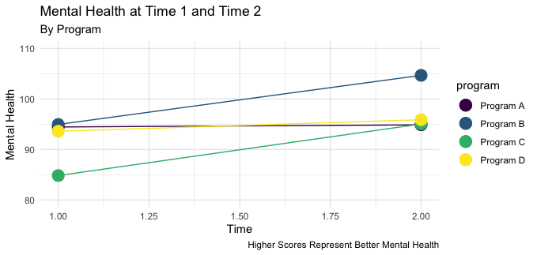

# Simulated Data From Social Service Agency

*Simulated* data for use in classes on Program Evaluation, Research Methods, Statistics and Data Visualization.

The data contain the following (*simulated*) variables:  "ID", "age", "gender", "race_ethnicity", "family_income", "program", "mental_health_T1", "mental_health_T2", "latitude", "longitude".

The *mental health* variables are scaled to have an average of 100. Lower numbers indicate lower mental health, while higher numbers indicate higher mental health.

There are some differences in *mental health* status in the data and an interesting exercise could be to use software like Excel, Google Sheets, Tableau or R to try to see which factors predict these differences.

## Dataviz Exercise

[Dataviz exercise](https://agrogan1.github.io/teaching/social-service-agency/social-service-agency.pdf) with *Simulated* Social Service Agency data.

## Dataset

> The Excel formatted version of this data may be the most readily useful: [https://agrogan1.github.io/teaching/social-service-agency/social-service-agency.xlsx](https://agrogan1.github.io/teaching/social-service-agency/social-service-agency.xlsx). Alternatively, you may prefer the CSV version of the *clients* data: [https://agrogan1.github.io/teaching/social-service-agency/clients.csv](https://agrogan1.github.io/teaching/social-service-agency/clients.csv)

The data can be used *independently* of the PDF handout and are *free to use and share* for other classes.

For example, you may wish to visualize these data using software like Excel, Google Sheets, or Tableau. See [*How To Choose A Chart: An Intuitive Guide*](https://agrogan1.github.io/dataviz/how-to-choose-a-chart-intuitive/how-to-choose-a-chart-intuitive.pdf)

## Data Explorer

Experimental [Data Explorer](./data-explorer.html)

