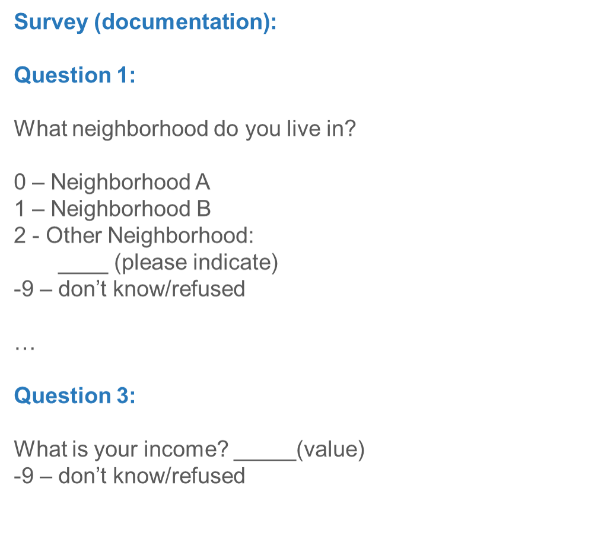

```{r setup, include=FALSE}

knitr::opts_chunk$set(echo = FALSE)

library(DT)

library(tibble)

library(pander)

output_format <- knitr::opts_knit$get("rmarkdown.pandoc.to")

```

# Introduction

A data set is nothing more than a series of rows and columns that contain answers to responses to a survey:

* *Rows* are usually used for *individuals* (although sometimes rows are larger social units like cities or states), while *columns* indicate the *questionnaire answers*, or *measures*, from those people.
* Answers to questions are often given numerical responses (e.g. “no” is frequently coded as “0” and “yes” is frequently coded as “1”)

# Simulated Data

```{r, eval=TRUE, fig.fullwidth = FALSE}

N <- 100

person <- seq(1, N)

neighborhood <- sample(c("A", "B", "C"), 
             N, 
             replace=TRUE, 
             prob=c(0.3, 0.4, 0.3))

neighborhood <- factor(neighborhood)

age <- 18 + rnorm(N, 20, 5) 

age <- round(age, digits = 0)

income <- rnorm(N, 10000, 25)

income <- round(income, digits = 2)

mydata <- tibble(person, 
                 neighborhood,
                 age, 
                 income)


if(output_format == "html"){
  
  datatable(mydata,
            rownames = FALSE,
            # caption = "Simulated Data",
            extensions = 'Buttons',
            options = list(
              dom = 'Bfrtip',
              buttons = c('copy', 'csv', 'excel', 'pdf', 'print')))


} else {pander(head(mydata))}

```

# Both The Data And Documentation Are Useful

In working through our research questions, we’ll constantly be going back and forth between the actual data (to see the pattern of responses) and the documentation, to figure out the actual question asked as well as how the different responses are coded.

```{r, out.width = "90%", fig.margin=TRUE}



```

# Missing Values

Some cells of the table above have a negative number. Frequently negative numbers are used to indicate what are called “missing values”. A missing value is a response like “don’t know” or “refused to answer” or “did not answer”. Before we start doing calculations with our data, we’ll want to change negative numbers to true missing values (usually symbolized by a “.” so that they don’t goof up our calculations.

# Variable Names Should Be Short

Often in a spreadsheet, you’ll see the full text of a question written out (e.g. “What neighborhood do you live in”?) Most programs that work with data are going to want abbreviations (e.g. “Q1” or “neighborhood”) for the questions. These abbreviations should usually have no spaces and be 8 characters or less.
