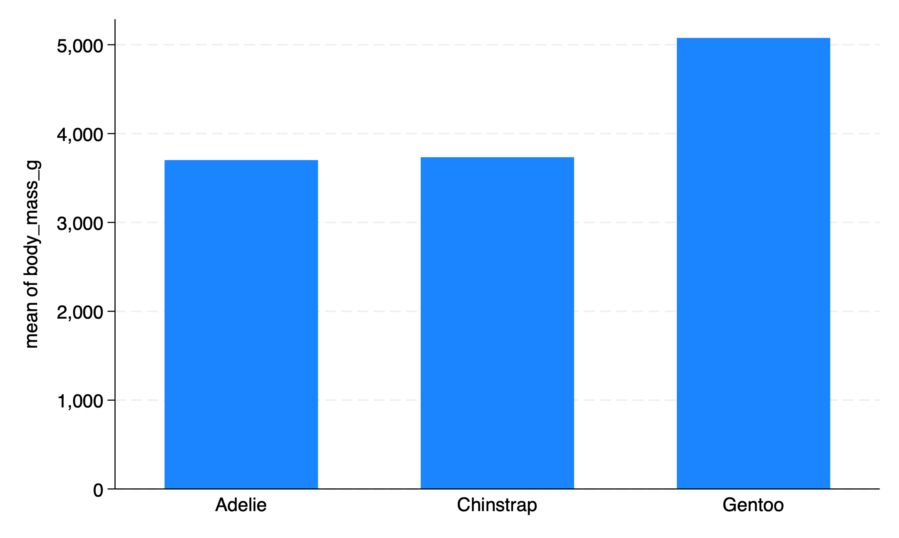

```{css, echo=FALSE}

d-article blockquote {
  color: black;
  border-left: 2px solid #FFCB05; 
  padding: 0.5em 10px;
}
  
```

```{r setup, include=FALSE}

knitr::opts_chunk$set(echo = FALSE)

```

# Introduction

I have increasingly been thinking about the idea of *workflow* in data science / data analysis work.

So many workflows follow the same conceptual pattern.

# Visually and Conceptually

```{r, fig.height=6}

DiagrammeR::grViz("

digraph workflow {

node [fontname = Helvetica, color = blue]

ask [label = 'ask a question']

open [label = 'open the raw data']

clean [label = 'clean the data, e.g. outliers & errors']

wrangle [label = 'create any new variables or scales']

descriptives [label = 'descriptive statistics']

visualize [label = 'visualize the data']

analyze [label = 'analyze with bivariate or multivariate statistics']

share [label = 'share your results with your community(ies)']

ask -> open 

open -> clean 

clean -> wrangle

wrangle -> descriptives

descriptives -> visualize

visualize -> analyze

analyze -> share


}")

```

# Characteristics of Good Workflows

Increasingly, we want to think about workflows that are 

* **documentable** and **auditable**: We have a record of what we did if we want to double check our work, clarify a result, or develop a new project with a similar process. We, or others, can find the inevitable errors in our work, **and correct them**.
* **replicable**: Others can replicate our findings with the same or new data.
* **scalable**: We are developing a process that can be as easily used with *thousands* or *millions* of rows of data as it can with *ten* rows of data. We are developing a process that can be easily repeated if we are *constantly getting new or updated data*, e.g. getting new data every week, or every month.

# Complex Workflows 

For **complex workflows**, we will often want to write a script.

> The more graphs or calculations I have to make, the more complex the project, the more the desires of the client are likely to change, the more frequently the data is being updated, and the more mission critical the results (i.e. I need auditability and error correction) the more likely I am to use a scripting tool like Stata or R.

+---------------+---------------+--------------------+
|               | Simple        | Complex Process:   |
|               | Process:      | Multiple Graphs or |
|               | Single Graph  | Calculations.      |
|               | or            |                    |
|               | Calculation   |                    |
+===============+===============+====================+
|**Process Run**| Spreadsheet:  | Scripting Tool:    |
| **Only Once** | Excel or      | Stata or R         |
|               | Google        |                    |
+---------------+---------------+--------------------+
| **Process**   | Scripting     | Scripting Tool:    |
| **Run **      | Tool: Stata   | Stata or R         |
| **Multiple**  | or R          |                    |
| **Times**     |               |                    |
|**(Perhaps As**|               |                    |
| **Data Are**  |               |                    |
| **Regularly** |               |                    |
| **Updated)**  |               |                    |
+---------------+---------------+--------------------+

: Tools for Different Workflows

> Always (or usually) beginning with the raw data, and then writing and running a script that generates our results allows us to develop a process that is **documentable**, **auditable**, **replicable** and **scalable**.

# Example

Below is an example that uses the [Palmer Penguins](https://allisonhorst.github.io/palmerpenguins/) data set. 

> The example below is in Stata, due to Stata's ease of readability, but could as easily be written in any other language that has scripting, such as SPSS, SAS, R, or Julia.

```{stata, eval = FALSE, echo = TRUE}

* Learning About Penguins

* Ask A Question

* What can I learn about penguins?
  
* Open The Raw Data

use "https://github.com/agrogan1/Stata/raw/master/do-files/penguins.dta", clear 

* Clean and Wrangle Data

generate big_penguin = body_mass_g > 4000 // create a big penguin variable

* Descriptive Statistics

summarize culmen_length_mm culmen_depth_mm flipper_length_mm body_mass_g

tabulate big_penguin

tabulate species

* Visualize The Data

graph bar body_mass_g, over(species) scheme(s1color) // bar graph

twoway scatter culmen_length_mm body_mass_g, scheme(s1color) // scatterplot

* Analyze

regress culmen_length_mm body_mass_g // regress culmen length on body mass

```

<aside>
```{r, fig.cap="Bar Graph of Penguin Species"}



```

```{r, fig.cap="Scatterplot of Penguin Culmen Length by Body Mass"}

knitr::include_graphics("myscatterplot.png")

```

```{r, fig.cap="Descriptive Statistics"}

knitr::include_graphics("mydescriptives.png")

```

```{r, fig.cap="Regression Results"}

knitr::include_graphics("myregression.png")

```
</aside>


